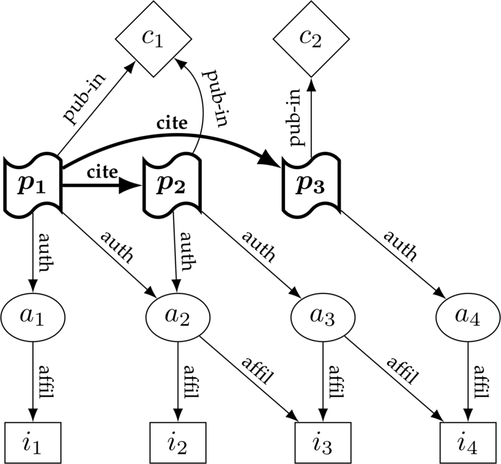

# Aim

## Aim of the dissertation

::: center
Metric of impact of dependencies in research software as
a definition of contribution to software for citation.
:::

# Software citation

## Background

- Digitalization: software is eating research ···ᗤ
- Software as a research product
- Research software citation [@smithSoftwareCitationPrinciples2016], e.g.:
    - Importance of software
    - Credit and attribution of software
- Implementation of software citation? [@druskatSoftwareDependenciesResearch2019]

::: notes

- Hardly any research conducted without research software
- Research software != general purpose tools
- What is software's place in research?
- Embeds or implements research knowledge
- Should be treated as a research product on par with papers (1st class citizen)
- Ergo: software should be cited
    - Importance principle: Cite software itself as you would papers
    - Citation should facilitate scholarly credit and normative attribution
- Problem: Implementation
- Citation system doesn't yet work for software
- The following summarizes Druskat 2019

:::

## Citation

- Sociotechnical system
- Functions:
    - context function
    - social functions (trust, authority, credit, evaluation)
    - compliance function
    - discursive function
    - reproducibility function

::: notes

- Context: enables tracability of outcomes
- Social: establishes trust and authority, enables credit and evaluation
- Compliance: with good scientific practice (DFG Code)
- Discursive: Organization/shaping of research discourses/"dynamically rewriting the past"
- Reproducibilty: Enabled through complete & correct citation

:::

## Citation and software

- Integration of software in the citation system
- Software-specific (vs. papers) & general challenges:
    - seriality, versions, concepts
    - identification
    - dynamicity & staticity
    - references in software?
    - contribution types

::: notes
- seriality & versions: paper only one (but preprint, concept never cited), software many + concepts
- identification: publication practices/PIDs; concepts are also identified
- dynamicity: n products (source code + states at runtime) BUT vs. principles
- dependencies: indirect & direct passive contributions become part of the object at runtime
- contribution types differ: general issue
:::

# Research citation graphs

## Modeling the citation system

**Context function**

- Citation between products: $G = (V,E)$
    - $V$ = research products
    - $E$ = `cite` relations ($p_1 \in V$ and $p_2 \in V$ and $(v_1, v_2) \in E$)

::: center

:::

::: notes
- Covers the context function
- back-tracking, forward-tracking
:::

## Current model

:::::::::::::: {.columns}
::: {.column width="50%"}

::: small
**Social functions**  
(trust & authority, credit, (evaluation))

$\mathcal{V} = \{P,A,I,C\}$ in $G_2 = (V, E)$

- Research products
- Authors
- Affiliations
- Containers
- `affil`, `auth`, `pub-in`, `cite`
:::

:::
::: {.column width="45%"}

:::
::::::::::::::

::: notes
- Represents the current system of citation for textual products
- A = authors, I = affiliations, C = containers
- V = set of disjoint sets of vertices in the graph
- Trust & authority for actors through citation
- Credit for actors through citations
- Enables evaluation
:::

## Improved model

:::::::::::::: {.columns}
::: {.column width="50%"}

::: small
**Compliance, reproducibility, discursivity**

$\mathcal{V} = \{P,A,I,C,O\}$ in $G_3 = (V, E)$

- Research products
- Authors
- Affiliations
- Containers
- Concepts
- `affil`, `contrib*`, `pub-in`, `cite`, `real`, `prec`
:::

:::
::: {.column width="45%"}

:::
::::::::::::::

::: notes
- Compliance with funders' guidelines through software citation
- DFG Code 2019: 

> Die Herkunft von im Forschungsprozess verwendeten Daten, Organismen, Materialien und Software wird kenntlich gemacht und die Nachnutzung belegt; die Originalquellen werden zitiert.

- Reproducibility through complete and exact referencing
- Discursivity possible even for software
:::

## Applications

:::::::::::::: {.columns}
::: {.column width="50%"}

- Citation tracking & analysis
- Contribution role analysis
- Software development practices
- Credit for "hidden" research contributions
- Transitive credit

:::
::: {.column width="45%"}

:::
::::::::::::::

::: notes
- How can RCGs be useful?
- back-tracking context exploration
- citation tracking
- tracking of concept citation
- self-citation analysis
- Contribution analysis: 
    - How are roles distributed over contributors
    - based on taxonomy fine-grained evaluation of contributors
- Credit for "hidden" contributions
    - Paper citations can be traced linearly
    - Dependencies can be found in the graph
- Transitive credit
:::

## Challenges

- Cultural challenges
- Software publication practice
- Metadata

::: notes
- Cultural challenges:
    - Software as a research product (Importance principle)
    - Practice of software citation
    - Unique identification of individuals and groups/entities
- Publication practice for research software:
    - Publication, formal publication
    - Unique identification
    - Incentives
- Metadata:
    - Provision, completeness, correctness, interoperability
:::

# (Transitive) impact of dependencies

## Research questions

- Improved citation model including software (dependencies)
- Discursivity & compliance functions: define contributions
- Application: transitive credit

**RQ1:** How to *define* the contribution of dependencies to a software?  
**RQ2:** How to *measure* the contribution of dependencies to a software?

::: notes
- To re-cap:
- Defined improved model which enables all citation functions for software
- Learned that the discursive function of citation enables the re-writing of history
- Against good scientific practice & compliance function:
    - disclose sources and predecessors
    - enable reproducibility through complete provenance information
    - define contributions to a research product = **fractional contributions**
    - dependencies (and transitive dependencies) may never be cited (non-research software)
- Definition of contribution by humans/papers: manually, augmented (spliddit)
:::

## Method

1. Define & retrieve a gold standard dataset of research software
2. Build a larger dataset of research software in Python from GitHub
3. Define the impact metric
4. Retrieve metrics for dataset
5. Evaluate metric & measurement implementation

## Impact of dependencies on research software

- Why impact?
    - <strike>Authority of authors?</strike>
    - <strike>LOC?</strike>
    - <strike>Gameable metrics (stars, downloads, forks)?</strike>

- Why measure programmatically?
    - Imprecise & expensive manual definition ("haggling")

- What is "impact"?
    - Frequency? Complexity? Efficiency?

::: notes
- Proposal: Impact seems a good criterion of contribution of dependencies
- All required dependencies impact software directly
- Frequency of use (quantitative)?
- Complexity (qualitative, "intellectual price tag")?
- Efficiency?

:::

## Questions?

::: {.center}

stephan.druskat@hu-berlin.de  
Twitter: [\@stdruskat](http://twitter.com/stdruskat)  
ORCiD [0000-0003-4925-7248](https://orcid.org/0000-0003-4925-7248)  
<!-- Slides: [doi:10.6084/m9.figshare.10296917](https://doi.org/10.6084/m9.figshare.10296917) -->

:::

# Appendix

## Digression: research software classification

- RQ: How can we classify software as research software?

## Software publication

Pros and cons (cf. principles)
- Lack of practice (peer review)
- Software papers

## Metadata

How to get it?

## PIDgraph

Implementation of RCG

## Why another metric?

Yes, why?

## References 